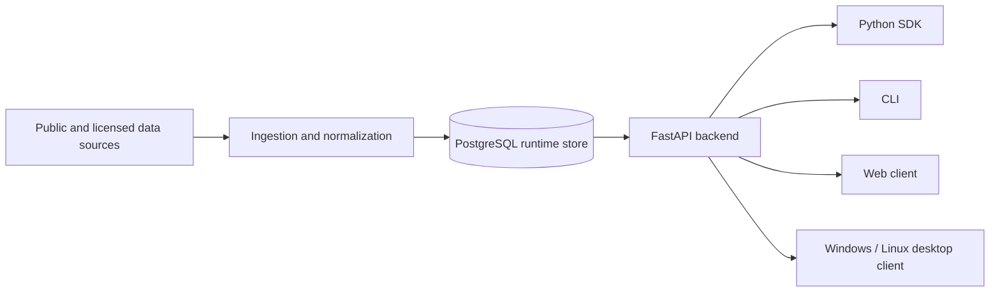

# Eurogas Nexus

[](https://github.com/AlexYuhuFeng/EurogasNexus/actions/workflows/ci.yml)
[](https://github.com/AlexYuhuFeng/EurogasNexus/actions/workflows/release.yml)
[](https://github.com/AlexYuhuFeng/EurogasNexus/releases)
[](https://www.python.org/)
[](https://www.postgresql.org/)
[](https://maplibre.org/)
[](https://tauri.app/)

Eurogas Nexus is a PostgreSQL-first intelligence workspace for European gas
portfolio monitoring, infrastructure visibility, route economics, source
diagnostics, strategy evaluation, and trader-reviewed decision support.

The project is built around a simple operating rule: runtime truth lives in
PostgreSQL, and every client reads it through the backend API or SDK.

> Current line: `v0.5-preview`
>
> Eurogas Nexus is not an ETRM replacement, execution venue, order router,
> nomination-submission system, auto-trading system, legal-advice tool, or
> official trading recommendation system.

## Contents

- [Product Scope](#product-scope)
- [Status](#status)
- [Architecture](#architecture)
- [Repository Layout](#repository-layout)
- [Quick Start](#quick-start)
- [Configuration](#configuration)
- [Database](#database)
- [Data Sources](#data-sources)
- [Clients](#clients)
- [SDK and CLI](#sdk-and-cli)
- [Testing](#testing)
- [Build and Release](#build-and-release)
- [Documentation](#documentation)
- [Security](#security)
- [中文说明](#中文说明)
- [License](#license)

## Product Scope

Eurogas Nexus targets commercial gas desks that need one workspace for:

- European gas infrastructure context across hubs, interconnection points,
  pipelines, LNG terminals, storage facilities, and balancing zones;
- DB-backed source monitoring for public and licensed providers;
- live or near-live market observations, where customer credentials and
  entitlements allow access;
- route feasibility and route-cost comparison using capacity, tariff, access,
  and contract constraints;
- European explicit-leg route-cost calculation, including public BBL/IUK
  corridor tariff rows, UK NTS reference rows, TSO access constraints, and
  capacity-constrained route/sale allocation;
- resource-pool-native portfolio optimization for physical gas, virtual hub
  positions, LNG regas, upstream offtake, screen purchases, and
  customer-imported trades;
- EFET-style contract entry so purchase contracts feed a portfolio pool before
  sales routes are optimized and PnL is attributed back to contracts;
- strategy backtesting, shadow-running, monitoring, and risk-control signals;
- bilingual glossary and operational context for European gas trading terms;
- LLM-assisted analysis through backend-controlled provider integrations.

The system supports decision-making. It does not execute trades or submit
physical operations on behalf of the user.

## Status

| Area | Current state |
| --- | --- |
| Backend API | FastAPI service with import-safe app factory |
| API path | Public client base path is `/api` |
| Database | PostgreSQL-first SQLAlchemy and Alembic foundation |
| Ingestion | Public-source and provider-control surfaces are in progress |
| Route cost | European explicit-leg route costing and capacity-constrained route/sale recommendation |
| SDK | Python SDK surface for released API workflows |
| CLI | Operator health, readiness, and validation commands |
| Web client | React + Vite + MapLibre resource-pool cockpit |
| Desktop client | Tauri shell for Windows NSIS and Linux DEB builds |
| Release | GitHub Actions builds Web, Windows, and Linux preview assets |

Production gaps must be shown as source-health, entitlement, readiness, or data
quality issues. The application must not hide missing live data behind
fabricated values. Demo records, when needed, are inserted into PostgreSQL with
demo provenance.

## Architecture



Core architecture rules:

- PostgreSQL is the runtime source of truth.
- Clients use the backend API or SDK; clients do not connect directly to the
  database.
- Provider credentials are owned by backend-controlled services, never by the
  Web or desktop UI.
- Backend import must not connect to PostgreSQL or run migrations.
- Migrations are explicit operator actions.
- Source failures must be visible and diagnosable.
- Data models should reflect real market practice before UI convenience.

## Repository Layout

```text
apps/                   Process entry points
  api/                  FastAPI runtime entry point
  scheduler/            Scheduled runtime job surface
  worker/               Background worker surface
clients/
  web/                  React, Vite, MapLibre Web client
  desktop/              Tauri desktop shell
src/eurogas_nexus/
  api/                  API factory, profiles, and routes
  cli/                  Operator CLI
  db/                   SQLAlchemy, sessions, registry, health checks
  domain/               Business-domain models and services
  ingestion/            Source adapters and ingestion contracts
  runtime_store/        PostgreSQL-backed repositories
  sdk/                  Python SDK clients
alembic/                Migration environment
docs/                   Architecture, contracts, operations, release docs
scripts/                Operator and release scripts
tests/                  API, contract, integration, SDK, CLI, release tests
```

For the full directory map, see [PROJECT_DIRECTORY.md](PROJECT_DIRECTORY.md).

## Quick Start

### Requirements

- Python 3.11+
- Node.js 20+
- Rust stable, required for desktop builds
- PostgreSQL, required for runtime validation and live-data workflows

### Install Python dependencies

```powershell
python -m pip install -e ".[dev]"
```

### Start the API

```powershell
uvicorn apps.api.main:app --host 127.0.0.1 --port 8000
```

Health check:

```powershell
python -c "from apps.api.main import app; print('app import ok'); print(len(app.routes))"
```

### Start the Web client

```powershell
npm --prefix clients/web ci
npm --prefix clients/web run dev
```

The Web client expects the backend API to be reachable from the configured API
base URL. During local development this is normally `http://127.0.0.1:8000`.

## Configuration

Database URL precedence:

1. `RUNTIME_STORE_DATABASE_URL`
2. `DATABASE_URL`
3. `EUROGAS_NEXUS_DB_DSN`, legacy fallback only

Operational rules:

- Never commit `.env` files.
- Never print full database URLs.
- Never commit provider API keys or customer credentials.
- Keep public-source and licensed-source credentials separate.
- Keep demo/test records clearly identifiable in PostgreSQL.

## Database

Validate a runtime database without writing data:

```powershell
python scripts/ops/validate_v1_runtime_db.py --json
```

The validation script:

- resolves the database URL using the configured precedence;
- redacts secrets in all output;
- checks connectivity with a read-only probe;
- checks required table presence;
- reports the Alembic revision when available;
- does not run migrations.

Migrations are managed through Alembic:

```powershell
alembic current
alembic upgrade head
```

Only run migrations against the intended runtime database.

## Data Sources

Eurogas Nexus separates provider configuration from business use. The Source
Center is the UI surface for provider categories, credentials, diagnostics,
last-update status, record counts, and failure reasons.

| Category | Providers and scope |
| --- | --- |
| Prices | Platts, ICIS, Argus, EEX, ICE OCM, Trayport, Kpler |
| FX | ECB reference rates |
| Infrastructure | ENTSOG, GIE AGSI, GIE ALSI |
| Tariffs | BBL, IUK, National Gas NTS, GTS, NaTran, German TSOs, Fluxys Belgium, CNMC/Enagas |
| Weather | HDD/CDD modelling provider slot |
| LLM | DeepSeek first, with later provider expansion |

Public feeds may not require API keys. Licensed feeds require the customer's
own credentials, entitlements, and contractual permission.

## Clients

### Web

The Web client is the primary map-focused workspace. It contains separate
surfaces for:

- Network: resource-pool map, recommended sale paths, route/capacity warnings,
  indicative PnL, and decision support;
- Data Sources: provider categories, API-key posture, diagnostics, and refresh
  state;
- Market: price, FX, capacity, tariff, and source observations;
- Scenario: route economics, LNG readiness, and pool optimization runs;
- Contracts: EFET-style resource, delivery, pricing, settlement, and capacity
  term entry;
- Strategy: backtest, shadow-run, monitoring, and risk controls;
- Review: trader-readable decision support and report output;
- Glossary: bilingual operational definitions and linked context;
- Runtime: API, database, and ingestion readiness;
- Settings: language, units, display preferences, and light/dark/system theme.

### Desktop

The desktop client packages the Web workspace through Tauri. Release workflow
targets:

- Windows NSIS installer;
- Linux Debian package.

Desktop clients must use the backend API. They must not become a local database
or credential store.

## SDK and CLI

Install the package in editable mode:

```powershell
python -m pip install -e ".[dev]"
```

Use the CLI:

```powershell
eurogas-nexus --help
```

The SDK and CLI follow the released backend API contract. They are intended for
operator checks, automation, internal tooling, notebooks, and integration tests.

## Testing

Recommended validation before pushing:

```powershell
ruff check .
pytest -q tests/api tests/contract tests/integration tests/sdk tests/cli tests/release tests/security
npm --prefix clients/web run build
python -c "from apps.api.main import app; print('app import ok'); print(len(app.routes))"
```

Additional focused suites:

```powershell
pytest -q tests/workflows tests/unit tests/ingestion tests/streaming
pytest -q tests/contract/test_client_release_surface.py
pytest -q tests/contract/test_docs_alignment.py
```

## Build and Release

GitHub Actions publishes preview releases from `main`:

- CI: Python linting, targeted backend tests, contract tests, SDK and CLI tests;
- Web build: Vite production build and packaged Web artifact;
- Desktop build: Windows NSIS installer and Linux DEB package;
- Release: GitHub pre-release with the generated artifacts.

Local release scripts mirror the workflow:

```powershell
./scripts/release/build_v1_release.ps1 -Bundle nsis
```

```bash
./scripts/release/build_v1_release.sh --bundle deb
```

Releases are published at
[github.com/AlexYuhuFeng/EurogasNexus/releases](https://github.com/AlexYuhuFeng/EurogasNexus/releases).

## Documentation

Start here:

- [Project directory](PROJECT_DIRECTORY.md)
- [Current pause point](docs/architecture/CURRENT_PAUSE_POINT.md)
- [Target product architecture](docs/architecture/TARGET_PRODUCT_ARCHITECTURE.md)
- [API contract](docs/contracts/06_API_CONTRACT.md)
- [Database contract](docs/contracts/04_DB_CONTRACT.md)
- [Runtime store contract](docs/contracts/05_RUNTIME_STORE_CONTRACT.md)
- [Resource pool contract](docs/contracts/21_RESOURCE_POOL_CONTRACT-EN.md)
- [Client API contract](docs/clients/CLIENT_API_CONTRACT.md)
- [Client tech stack](docs/clients/CLIENT_TECH_STACK.md)
- [Map-first trader cockpit spec EN](docs/clients/MAP_FIRST_TRADER_COCKPIT_SPEC-EN.md)
- [Map-first trader cockpit spec CN](docs/clients/MAP_FIRST_TRADER_COCKPIT_SPEC-CN.md)
- [UI/UX style guide EN](docs/clients/UI_UX_STYLE_GUIDE-EN.md)
- [UI/UX style guide CN](docs/clients/UI_UX_STYLE_GUIDE-CN.md)
- [Live PostgreSQL operations](docs/operations/LIVE_POSTGRESQL_V1.md)
- [Validation guide](docs/operations/VALIDATION.md)
- [Release readiness](docs/release/V1_RELEASE_READINESS.md)

## Security

This is a public repository. Do not commit:

- `.env` files;
- API keys, tokens, passwords, or provider credentials;
- real vendor data or raw licensed market data;
- internal commercial data;
- confidential contracts or counterparty terms;
- real strategy parameters;
- customer deployment details.

Report security issues through [SECURITY.md](SECURITY.md).

## 中文说明

Eurogas Nexus 是面向欧洲天然气交易与运营团队的 PostgreSQL 优先智能工作台，用于统一管理
管网、枢纽、互联点、LNG 接收站、储气库、容量、费率、市场价格、汇率、合同、资源池、路线经济性、
策略监控、数据源诊断和术语知识。

核心原则：

- 运行时事实数据必须进入 PostgreSQL；
- Web、Windows、Linux、SDK 和 CLI 都必须通过后端 API 或 SDK 访问数据；
- 客户端不得直接连接数据库；
- 客户端不得保存供应商 API Key 或客户凭据；
- 数据源故障、权限缺失、表缺失、刷新失败必须明确展示；
- 不得用伪造实时数据掩盖真实数据缺口；
- 如需演示数据，应写入 PostgreSQL，并标注为 demo/test provenance。

当前 `v0.5-preview` 版本提供决策支持和市场分析能力，但不执行交易、不下单、不路由订单、
不提交提名、不替代 ETRM、不提供法律意见，也不构成官方交易建议。

中文文档入口：

- [地图优先交易工作台规范](docs/clients/MAP_FIRST_TRADER_COCKPIT_SPEC-CN.md)
- [UI/UX 风格指南](docs/clients/UI_UX_STYLE_GUIDE-CN.md)
- [LLM 分析与报告规范](docs/architecture/LLM_ANALYSIS_REPORTING_SPEC-CN.md)
- [市场实践审计](docs/architecture/MARKET_PRACTICE_AUDIT-CN.md)
- [市场定位数据导入说明](docs/operations/MARKET_POSITIONING_IMPORTS-CN.md)

## License

Proprietary. All rights reserved unless a separate written license grants
additional rights.
