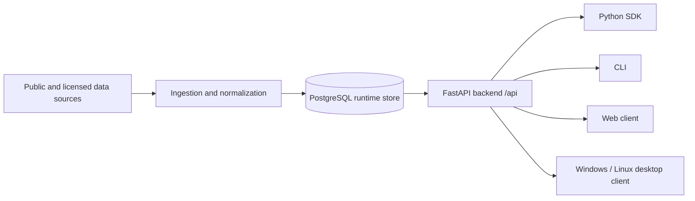

# Eurogas Nexus

[](https://github.com/AlexYuhuFeng/EurogasNexus/actions/workflows/ci.yml)
[](https://github.com/AlexYuhuFeng/EurogasNexus/actions/workflows/release.yml)
[](https://github.com/AlexYuhuFeng/EurogasNexus/releases)
[](https://www.python.org/)
[](https://www.postgresql.org/)
[](https://maplibre.org/)
[](https://tauri.app/)

Eurogas Nexus is a PostgreSQL-first European gas intelligence workspace for
portfolio monitoring, infrastructure visibility, route economics, data-source
operations, strategy evaluation, and trader-reviewed decision support.

Runtime truth lives in PostgreSQL. Web, Windows, Linux, SDK, and CLI clients read
runtime data through the backend API or SDK. Public client integrations target
the single unversioned `/api` surface.

Current line: `v0.5-preview`

License: proprietary, all rights reserved. See [`LICENSE`](LICENSE).

Eurogas Nexus is not an ETRM replacement, execution venue, order router,
nomination-submission system, auto-trading system, legal-advice tool, settlement
system, or official trading recommendation system.

## Product Scope

Eurogas Nexus is built for commercial European gas desks that need one workspace
for:

- infrastructure context across hubs, interconnection points, pipelines, LNG
  terminals, storage facilities, and balancing zones;
- DB-backed source monitoring for public and licensed providers;
- live or near-live market observations when customer access rights allow;
- route feasibility and route-cost comparison using capacity, tariff, access,
  and resource-term constraints;
- resource-pool-native portfolio optimization for physical gas, virtual hub
  positions, LNG regas, upstream offtake, screen purchases, and imported market
  observations;
- EFET-style resource-term capture so resource assumptions feed a portfolio pool
  before sales routes are optimized and PnL is attributed back to resource terms;
- strategy backtesting, shadow-running, monitoring, and risk-control signals;
- bilingual glossary and operational context for European gas trading terms;
- LLM-assisted analysis through backend-controlled provider integrations.

Route cost and allocation are Europe-wide explicit-leg concepts. The model
supports UK NTS, BBL, IUK, and additional TSO tariff source slots in the runtime
data model. Unsupported tariff rows must be imported into PostgreSQL before the
client presents them as available.

Production gaps must be shown as source-health, entitlement, readiness, or data
quality issues. The application must not hide missing live data behind fabricated
client values. Preview rows, when needed, are inserted into PostgreSQL with
explicit source provenance.

## Product Visuals

Eurogas Nexus is a visual, map-first decision-support product. README screenshots
should be synthetic or sanitized and must not contain licensed vendor material,
customer material, or real strategy parameters.

Recommended README visual set:

| Surface | Purpose | Suggested file |
| --- | --- | --- |
| Network map cockpit | European map-first workspace, resource-pool overlay, route candidates, warnings, and indicative PnL. | `docs/assets/readme/network-map-cockpit.png` |
| Scenario and route economics | Resource, destination, route, tariff, LNG readiness, and missing-input validation. | `docs/assets/readme/scenario-route-economics.png` |
| Review and report | Candidate comparison, warning stack, source references, lineage, and LLM-assisted commentary with human-review badges. | `docs/assets/readme/review-report.png` |

Authoritative UI contracts:

- [`docs/clients/WORKSPACE_NAVIGATION_SPEC.md`](docs/clients/WORKSPACE_NAVIGATION_SPEC.md)
- [`docs/clients/MAP_FIRST_TRADER_COCKPIT_SPEC-EN.md`](docs/clients/MAP_FIRST_TRADER_COCKPIT_SPEC-EN.md)
- [`docs/clients/MAP_FIRST_TRADER_COCKPIT_SPEC-CN.md`](docs/clients/MAP_FIRST_TRADER_COCKPIT_SPEC-CN.md)
- [`docs/clients/UI_UX_STYLE_GUIDE-EN.md`](docs/clients/UI_UX_STYLE_GUIDE-EN.md)
- [`docs/clients/UI_UX_STYLE_GUIDE-CN.md`](docs/clients/UI_UX_STYLE_GUIDE-CN.md)

## Architecture



Core rules:

- PostgreSQL is the runtime source of truth.
- Public client paths use `/api`.
- Clients use backend API or SDK only.
- Clients do not connect directly to PostgreSQL.
- Provider access material is backend-owned and never printed.
- Backend import must not open runtime database connections or run migrations.
- Migrations are explicit operator actions.
- Source failures must be visible and diagnosable.

## Quick Start

Requirements:

- Python 3.11+
- Node.js 24+
- Rust stable for desktop builds
- PostgreSQL for runtime workflows

```bash
python -m pip install -e ".[dev]"
uvicorn apps.api.main:app --host 127.0.0.1 --port 8000
```

```bash
npm --prefix clients/web ci
npm --prefix clients/web run dev
```

The Web client defaults to `/api` in browser mode and to
`http://127.0.0.1:8000/api` in the Tauri desktop shell. Settings can store a
non-secret backend API override; remote endpoints must use HTTPS and end in
`/api`.

## Database and Runtime

Database URL precedence:

1. `RUNTIME_STORE_DATABASE_URL`
2. `DATABASE_URL`
3. `EUROGAS_NEXUS_DB_DSN`, legacy compatibility only

Useful operator commands:

```bash
python scripts/ops/validate_runtime_db.py --json
python scripts/ops/seed_preview_runtime_data.py
python scripts/ops/ingest_simulated_market_prices.py --loop
python scripts/ops/materialize_reference_edges.py
alembic current
alembic upgrade head
```

Compatibility command:

```bash
python scripts/ops/validate_v1_runtime_db.py --json
```

Only run migrations against the intended runtime database.

## Data Sources

The Source Center is the UI surface for provider categories, access posture,
diagnostics, last-update status, record counts, and failure reasons.

| Category | Providers and scope |
| --- | --- |
| Prices | Platts, ICIS, Argus, EEX, ICE OCM, Trayport, Kpler |
| Price simulation | EEX_Sim, ICE_OCM_Sim, Trayport_Sim, ICIS_Sim for source-shaped runtime testing |
| FX | ECB reference rates |
| Infrastructure | ENTSOG, GIE AGSI, GIE ALSI |
| Tariffs | BBL, IUK, National Gas NTS, GTS, NaTran, German TSOs, Fluxys Belgium, CNMC/Enagas |
| Weather | HDD/CDD modelling provider slot |
| LLM | DeepSeek first, with later provider expansion |

Public feeds may not require access keys. Licensed feeds require the customer's
own rights and contractual permission.

## Clients

The Web client is the primary map-focused workspace. It uses grouped navigation:

- Decision Workspace: Network, Scenario, Review;
- Commercial Inputs: Resource Terms, Market, Capacity, Market Positioning;
- Analytics: Strategy, Glossary;
- Operations: Data Sources, Runtime, Settings, Manual.

`Resource Terms` is the user-facing name for EFET-style resource assumptions used
by the resource-pool optimizer. The technical route id remains `contracts` for
compatibility. `Market Positioning` is read-only imported screen observation and
PnL context. The technical route id remains `orders` for compatibility.

The desktop client packages the same Web workspace through Tauri and targets
Windows NSIS and Linux Debian packages. Desktop clients must use the backend API;
they must not become a local database or access-material store.

## Testing

Recommended validation before pushing:

```bash
ruff check .
pytest -q tests/api tests/contract tests/integration tests/ingestion tests/unit tests/optimization tests/sdk tests/cli tests/release tests/security
npm --prefix clients/web run build
python -c "from apps.api.main import app; print('app import ok'); print(len(app.routes))"
```

Future hardening should add type-checking, safety scanning, dependency audit,
and doc-hygiene checks to CI. Track that work in
[`docs/release/PRODUCTION_READINESS_BACKLOG.md`](docs/release/PRODUCTION_READINESS_BACKLOG.md).

## Build and Release

GitHub Actions validates and publishes a preview release after each successful
push to `main`. The same workflow can be run manually for preview, release
candidate, or stable channels.

- CI: Python linting, tests, API import, and Web build;
- Web release build: Vite production build and packaged Web artifact;
- Desktop release build: Windows x64 NSIS plus Linux x64 and ARM64 DEB packages;
- Runtime image: multi-architecture API image published to GitHub Container Registry;
- Deployment bundle: `Server`, `Client`, and `AllInOne` Windows deployment tooling;
- Release: GitHub release or pre-release with generated artifacts.

Customer deployment roles are fixed:

- `Server`: PostgreSQL, migrations, API, HTTPS gateway, ingestion workers;
- `Client`: desktop client only, connected to an existing HTTPS `/api` URL;
- `AllInOne`: Server and Client on one device.

See [Deployment roles EN](docs/deployment/DEPLOYMENT_ROLES-EN.md) and
[部署角色 CN](docs/deployment/DEPLOYMENT_ROLES-CN.md).

Local release scripts mirror the workflow:

```powershell
./scripts/release/build_release.ps1 -Bundle nsis
```

```bash
bash scripts/release/build_release.sh --bundle deb
```

Compatibility scripts are retained temporarily:

```powershell
./scripts/release/build_v1_release.ps1 -Bundle nsis
```

```bash
bash scripts/release/build_v1_release.sh --bundle deb
```

## Documentation

Start here:

- [Project directory](PROJECT_DIRECTORY.md)
- [API path policy](docs/api/API_PATH_POLICY.md)
- [API contract](docs/contracts/06_API_CONTRACT.md)
- [Database contract](docs/contracts/04_DB_CONTRACT.md)
- [Runtime store contract](docs/contracts/05_RUNTIME_STORE_CONTRACT.md)
- [Resource pool contract EN](docs/contracts/21_RESOURCE_POOL_CONTRACT-EN.md)
- [Resource pool contract CN](docs/contracts/21_RESOURCE_POOL_CONTRACT-CN.md)
- [Client API contract](docs/clients/CLIENT_API_CONTRACT.md)
- [Client tech stack](docs/clients/CLIENT_TECH_STACK.md)
- [Workspace navigation spec](docs/clients/WORKSPACE_NAVIGATION_SPEC.md)
- [Map-first trader cockpit spec EN](docs/clients/MAP_FIRST_TRADER_COCKPIT_SPEC-EN.md)
- [Map-first trader cockpit spec CN](docs/clients/MAP_FIRST_TRADER_COCKPIT_SPEC-CN.md)
- [UI/UX style guide EN](docs/clients/UI_UX_STYLE_GUIDE-EN.md)
- [UI/UX style guide CN](docs/clients/UI_UX_STYLE_GUIDE-CN.md)
- [Live PostgreSQL operations](docs/operations/LIVE_POSTGRESQL.md)
- [Validation guide](docs/operations/VALIDATION.md)
- [Release readiness](docs/release/RELEASE_READINESS.md)
- [Production readiness backlog](docs/release/PRODUCTION_READINESS_BACKLOG.md)
- [Documentation audit](docs/architecture/DOCUMENTATION_AUDIT.md)

## Governance and Production Readiness

- Repository boundary and contribution rules: [`CONTRIBUTING.md`](CONTRIBUTING.md)
- License and ownership: [`LICENSE`](LICENSE)
- Current release-candidate evidence: [`docs/release/RELEASE_READINESS.md`](docs/release/RELEASE_READINESS.md)
- Actionable production backlog: [`docs/release/PRODUCTION_READINESS_BACKLOG.md`](docs/release/PRODUCTION_READINESS_BACKLOG.md)

Release-candidate status means the tested local scope is coherent. It does not
mean production multi-user deployment is complete.

## Security

This is a public repository. Do not commit restricted provider access material,
licensed vendor payloads, internal commercial material, confidential contracts or
counterparty terms, customer deployment details, real strategy parameters, or
non-public runtime configuration.

Report security issues through [`SECURITY.md`](SECURITY.md).

## 中文说明

Eurogas Nexus 是面向欧洲天然气交易与运营团队的 PostgreSQL 优先智能工作台，用于统一管理管网、枢纽、互联点、LNG 接收站、储气库、容量、费率、市场价格、汇率、资源条款、资源池、路线经济性、策略监控、数据源诊断和术语知识。

当前 `v0.5-preview` 版本提供决策支持和市场分析能力，但不执行交易、不下单、不路由订单、不提交提名、不替代 ETRM、不提供法律意见，也不构成官方交易建议。

## License

Proprietary. All rights reserved unless a separate written agreement grants
additional rights. See [`LICENSE`](LICENSE).
