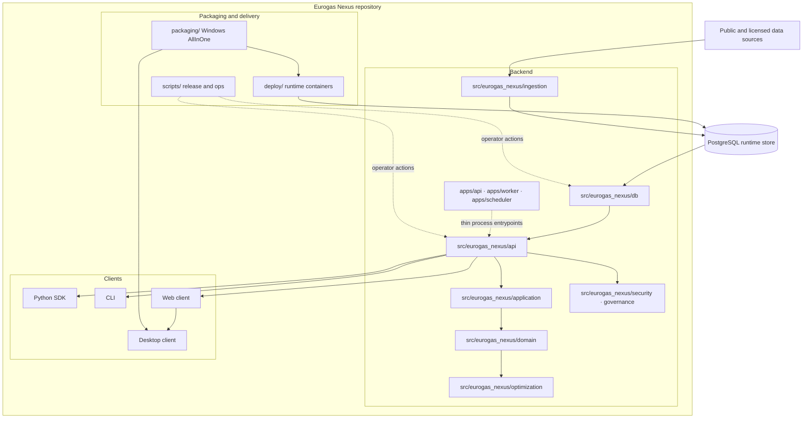

# Eurogas Nexus

[](https://github.com/AlexYuhuFeng/EurogasNexus/actions/workflows/ci.yml)
[](https://github.com/AlexYuhuFeng/EurogasNexus/actions/workflows/release.yml)
[](https://github.com/AlexYuhuFeng/EurogasNexus/releases)
[](https://www.python.org/)
[](https://www.postgresql.org/)
[](https://maplibre.org/)
[](https://tauri.app/)

Eurogas Nexus is a PostgreSQL-first European gas intelligence and
decision-support workspace for infrastructure visibility, source operations,
route economics, resource-pool optimization, market positioning, strategy
evaluation, and trader-reviewed analysis.

Runtime truth lives in PostgreSQL and is exposed through the backend API or
Python SDK. Web, Windows, Linux, SDK, CLI, and public integrations all consume
the single unversioned `/api` surface.

Current line: `v0.5-preview` · Status: release candidate for the tested local
scope, not production multi-user deployment.

## Product boundary

Eurogas Nexus is a decision-support workspace. It is not an ETRM replacement,
execution venue, order router, nomination-submission system, auto-trading
system, legal-advice tool, settlement system, or official trading
recommendation system. Every strategy, route, allocation, and report output is
a candidate that requires human review.

## What is in this preview

- DB-composed portfolio network optimization with shared-capacity flow and
  contract-level PnL attribution.
- Map-first Network workspace, route/Scenario economics, and structured Review
  evidence.
- Source Center with PostgreSQL-backed provider posture, credentials,
  certification, freshness, and diagnostics.
- 10-second intraday opportunity monitoring and deduplicated live DeepSeek
  explanations for persisted alerts.
- Strategy backtesting, shadow-running, persisted run history, and risk-control
  signals.
- Storage-dispatch and nomination-window assessment workflows (assessment only;
  nothing is submitted).
- Local identities, hashed API keys, roles, commercial data scopes, and OIDC
  access-token verification.
- Web workspace packaged for Windows and Linux through Tauri, plus Server,
  Client-only, and AllInOne deployment roles.

## Architecture


```mermaid
flowchart TB
    subgraph Repo["Eurogas Nexus repository"]
        direction TB
        subgraph Backend["Backend"]
            Apps["apps/api · apps/worker · apps/scheduler"]
            Ing["src/eurogas_nexus/ingestion"]
            Api["src/eurogas_nexus/api"]
            App["src/eurogas_nexus/application"]
            Domain["src/eurogas_nexus/domain"]
            Db["src/eurogas_nexus/db"]
            Opt["src/eurogas_nexus/optimization"]
            Gov["src/eurogas_nexus/security · governance"]
        end

        subgraph Clients["Clients"]
            SDK["Python SDK"]
            CLI["CLI"]
            Web["Web client"]
            Desktop["Desktop client"]
        end

        subgraph Delivery["Packaging and delivery"]
            Deploy["deploy/ runtime containers"]
            Installer["packaging/ Windows AllInOne"]
            Scripts["scripts/ release and ops"]
        end
    end

    Sources["Public and licensed data sources"] --> Ing
    Ing --> PG[("PostgreSQL runtime store")]
    PG --> Db
    Db --> Api
    Api --> App
    App --> Domain
    Domain --> Opt
    Api --> Gov

    Apps -. "thin process entrypoints" .-> Api
    Api --> SDK
    Api --> CLI
    Api --> Web
    Web --> Desktop

    Deploy --> PG
    Installer --> Desktop
    Installer --> Deploy
    Scripts -. "operator actions" .-> Db
    Scripts -. "operator actions" .-> Api
```

Core rules:

- PostgreSQL is the runtime source of truth; Alembic owns schema changes.
- Public client paths use `/api`. Internal and development routes are
  profile-gated under `/api/internal` and `/api/dev`.
- Clients consume the backend API or SDK only; they never connect directly to
  PostgreSQL.
- Provider access material is backend-owned and is never returned in plaintext.
- Backend import is DB-free and network-free; migrations are explicit operator
  actions.
- Missing or stale runtime data is surfaced as a diagnostic state, never
  replaced with fabricated client-side values.

## Quick start

Requirements: Python 3.11+, Node.js 24+, PostgreSQL for runtime workflows, and
Rust only for desktop packaging.

```bash
python -m pip install -e ".[dev]"
uvicorn apps.api.main:app --host 127.0.0.1 --port 8000
```

```bash
npm --prefix clients/web ci
npm --prefix clients/web run dev
```

The Web client defaults to `/api` in browser mode and to
`http://127.0.0.1:8000/api` in the Tauri desktop shell. Settings can store a
non-secret backend API override; remote endpoints must use HTTPS and end in
`/api`.

Full environment, database URL, and Docker runtime instructions:

- [Local development](docs/operations/LOCAL_DEVELOPMENT.md)
- [Local Docker runtime troubleshooting](docs/operations/LOCAL_DOCKER_RUNTIME.md)
- [Live PostgreSQL operations](docs/operations/LIVE_POSTGRESQL.md)
- [DB migration runbook](docs/operations/DB_MIGRATIONS.md)

## Verification

Before submitting changes:

```bash
ruff check .
pytest -q tests
npm --prefix clients/web run build
python -c "from apps.api.main import app; print('app import ok'); print(len(app.openapi()['paths']))"
```

Documentation integrity:

```bash
python scripts/ci/check_markdown_links.py
```

Detailed guidance is in [Validation](docs/operations/VALIDATION.md) and
[Release readiness](docs/release/RELEASE_READINESS.md).

## Documentation map

- [Changelog](CHANGELOG.md)
- [Documentation index](docs/README.md) — current, normative, runbook, design
  reference, and historical documents.
- [中文文档索引](docs/README-CN.md)
- [Project directory and ownership](PROJECT_DIRECTORY.md)
- [Architecture decisions](docs/architecture/ARCHITECTURE_DECISION_RECORD.md)
- [RFC process](docs/engineering/RFC_PROCESS.md)
- [Archive policy](docs/policies/ARCHIVE_POLICY.md)
- [UI and content standards](docs/clients/UI_CONTENT_STANDARDS.md)

## Security, contribution, and license

This is a public source-visible repository for proprietary software. Do not
commit provider access material, licensed vendor payloads, internal commercial
material, confidential contracts or counterparty terms, customer deployment
details, real strategy parameters, or non-public runtime configuration.

- Security reporting: [SECURITY.md](SECURITY.md)
- Contribution rules: [CONTRIBUTING.md](CONTRIBUTING.md)
- License: [LICENSE](LICENSE) — proprietary, all rights reserved unless a
  separate written agreement grants additional rights.

中文说明：Eurogas Nexus 是面向欧洲天然气分析与运营团队的 PostgreSQL 优先
智能工作台，提供决策支持而非执行、下单、提名或官方交易建议。中文文档入口见
[docs/README-CN.md](docs/README-CN.md)。
