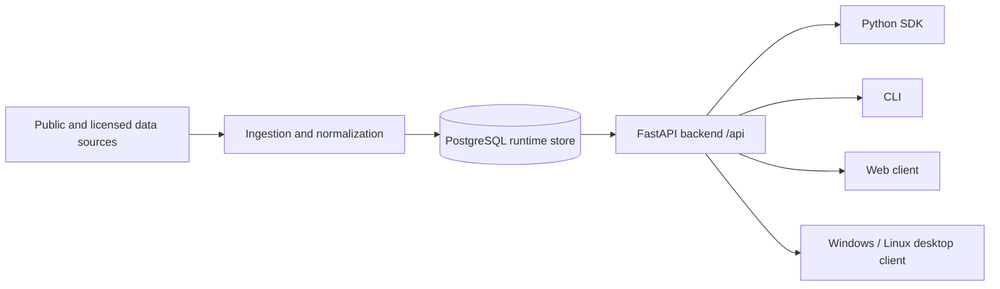

# Eurogas Nexus

[](https://github.com/AlexYuhuFeng/EurogasNexus/actions/workflows/ci.yml)
[](https://github.com/AlexYuhuFeng/EurogasNexus/actions/workflows/release.yml)
[](https://github.com/AlexYuhuFeng/EurogasNexus/releases)
[](https://www.python.org/)
[](https://www.postgresql.org/)
[](https://maplibre.org/)
[](https://tauri.app/)

Eurogas Nexus is a PostgreSQL-first European gas intelligence workspace for
portfolio monitoring, infrastructure visibility, route economics, data-source
operations, strategy evaluation, and trader-reviewed decision support.

Runtime truth lives in PostgreSQL. Web, Windows, Linux, SDK, and CLI clients read
runtime data through the backend API or SDK. Public client integrations target
the single unversioned `/api` surface.

Current line: `v0.5-preview`

### What's New In This Preview

For daily users:

- **Portfolio network optimization** now composes contracts, routes, capacity,
  TSO access, tariffs, market prices, and FX directly from PostgreSQL and
  attributes PnL back to each contract.
- **Multi-user identity** is available through backend-managed operator
  accounts, role permissions, data scopes, and hashed API keys. OIDC access
  tokens can also be verified when the customer issuer is configured.
- **Data-source operations** include bounded retry/backoff and freshness SLAs
  for public feeds.
- **Storage and nomination assessment** workspaces are available for review;
  nomination results are assessment only and are never submitted.
- Legacy `/api/workflows/*` pages have been retired; current functionality is
  available through the domain-specific `/api` routes.

For deployment owners:

- Server deployment remains **private-network/VPN-only by default**.
- Public-network deployment requires both
  `EUROGAS_NEXUS_DEPLOYMENT_POSTURE=security_accepted` and an operator-reviewed
  `EUROGAS_NEXUS_SECURITY_ACCEPTANCE_EVIDENCE` file. Enabling the switch alone
  is not sufficient.

> Technical worktree baseline (migrations, table count, path count, and
> increment evidence) is maintained in
> [`docs/architecture/CURRENT_PAUSE_POINT.md`](docs/architecture/CURRENT_PAUSE_POINT.md).

License: proprietary, all rights reserved. See [`LICENSE`](LICENSE).

Eurogas Nexus is not an ETRM replacement, execution venue, order router,
nomination-submission system, auto-trading system, legal-advice tool, settlement
system, or official trading recommendation system.

## Product Scope

Eurogas Nexus is built for commercial European gas desks that need one workspace
for:

- infrastructure context across hubs, interconnection points, pipelines, LNG
  terminals, storage facilities, and balancing zones;
- DB-backed source monitoring for public and licensed providers;
- live or near-live market observations when customer access rights allow;
- DB-backed 10-second intraday quote refresh and route-adjusted spread
  candidates using executable bid/ask sides, visible depth, capacity, tariffs,
  FX, and company TSO access;
- route feasibility and route-cost comparison using capacity, tariff, access,
  and resource-term constraints;
- resource-pool-native portfolio optimization for physical gas, virtual hub
  positions, LNG regas, upstream offtake, screen purchases, and imported market
  observations;
- EFET-style resource-term capture so resource assumptions feed a portfolio pool
  before sales routes are optimized and PnL is attributed back to resource terms;
- strategy backtesting, shadow-running, monitoring, and risk-control signals;
- DB-composed portfolio network optimization with shared-capacity flow and
  contract-level PnL attribution;
- PostgreSQL-backed local identities, hashed API keys, role authorization,
  commercial data scopes, and OIDC access-token verification;
- storage-dispatch and nomination-window assessment workflows (assessment
  only; no submission action);
- bounded source retry/backoff and freshness SLAs for public ingestion;
- bilingual glossary and operational context for European gas trading terms;
- LLM-assisted analysis through backend-controlled provider integrations.
- visible 10-second monitoring of opportunities, strategy alerts, and source
  failures, with deduplicated live DeepSeek explanations and per-alert dialogue;

Route cost and allocation are Europe-wide explicit-leg concepts. The model
supports UK NTS, BBL, IUK, and additional TSO tariff source slots in the runtime
data model. Unsupported tariff rows must be imported into PostgreSQL before the
client presents them as available.

Production gaps must be shown as source-health, entitlement, readiness, or data
quality issues. The application must not hide missing live data behind fabricated
client values. Preview rows, when needed, are inserted into PostgreSQL with
explicit source provenance.

## Product Visuals

Eurogas Nexus is a visual, map-first decision-support product. README screenshots
should be synthetic or sanitized and must not contain licensed vendor material,
customer material, or real strategy parameters.

Recommended README visual set:

| Surface | Purpose | Suggested file |
| --- | --- | --- |
| Network map cockpit | European map-first workspace, resource-pool overlay, route candidates, warnings, and indicative PnL. | `docs/assets/readme/network-map-cockpit.png` |
| Scenario and route economics | Resource, destination, route, tariff, LNG readiness, and missing-input validation. | `docs/assets/readme/scenario-route-economics.png` |
| Review and report | Candidate comparison, warning stack, source references, lineage, and LLM-assisted commentary with human-review badges. | `docs/assets/readme/review-report.png` |

Authoritative UI contracts:

- [`docs/clients/WORKSPACE_NAVIGATION_SPEC.md`](docs/clients/WORKSPACE_NAVIGATION_SPEC.md)
- [`docs/clients/MAP_FIRST_TRADER_COCKPIT_SPEC-EN.md`](docs/clients/MAP_FIRST_TRADER_COCKPIT_SPEC-EN.md)
- [`docs/clients/MAP_FIRST_TRADER_COCKPIT_SPEC-CN.md`](docs/clients/MAP_FIRST_TRADER_COCKPIT_SPEC-CN.md)
- [`docs/clients/UI_UX_STYLE_GUIDE-EN.md`](docs/clients/UI_UX_STYLE_GUIDE-EN.md)
- [`docs/clients/UI_UX_STYLE_GUIDE-CN.md`](docs/clients/UI_UX_STYLE_GUIDE-CN.md)
- [`docs/product/INTRADAY_DECISION_FEED-EN.md`](docs/product/INTRADAY_DECISION_FEED-EN.md)
- [`docs/product/INTRADAY_DECISION_FEED-CN.md`](docs/product/INTRADAY_DECISION_FEED-CN.md)

## Architecture


```mermaid
flowchart LR
    Sources["Public and licensed data sources"] --> Ingestion["Ingestion and normalization"]
    Ingestion --> DB[("PostgreSQL runtime store")]
    DB --> API["FastAPI backend /api"]
    API --> SDK["Python SDK"]
    API --> CLI["CLI"]
    API --> Web["Web client"]
    API --> Desktop["Windows / Linux desktop client"]
```

Core rules:

- PostgreSQL is the runtime source of truth.
- Public client paths use `/api`.
- Clients use backend API or SDK only.
- Clients do not connect directly to PostgreSQL.
- Provider access material is backend-owned and never printed.
- Backend import must not open runtime database connections or run migrations.
- Migrations are explicit operator actions.
- Source failures must be visible and diagnosable.

## Quick Start

Requirements:

- Python 3.11+
- Node.js 24+
- Rust stable for desktop builds
- PostgreSQL for runtime workflows

```bash
python -m pip install -e ".[dev]"
uvicorn apps.api.main:app --host 127.0.0.1 --port 8000
```

```bash
npm --prefix clients/web ci
npm --prefix clients/web run dev
```

The Web client defaults to `/api` in browser mode and to
`http://127.0.0.1:8000/api` in the Tauri desktop shell. Settings can store a
non-secret backend API override; remote endpoints must use HTTPS and end in
`/api`.

### Docker runtime cannot connect?

If you run the `.local-runtime` Docker stack and open
`http://127.0.0.1:3000`, it now defaults to the development profile, so no
API token is required and `/docs` plus `/openapi.json` are available. The
local public-ingestion worker runs ECB only; ENTSOG/GIE live workers are
disabled until provider certification/credentials are configured, so the
preview seed data remains the local reference data. If you switch the stack
back to the release profile, the public API token is required:

1. Open **Settings** in the Web workspace.
2. Set **Backend API URL**:
   - `http://127.0.0.1:3000/api` when using the Docker Web container proxy, or
   - `http://127.0.0.1:8765/api` when connecting directly to the Docker API.
3. Set **API token** to the value of
   `EUROGAS_NEXUS_PUBLIC_API_TOKEN` in `.local-runtime/.env`.
4. Set **operator principal** to a valid name such as `operator`.
5. Save and retry.

Quick check from the host:

```bash
TOKEN=$(grep '^EUROGAS_NEXUS_PUBLIC_API_TOKEN=' .local-runtime/.env | cut -d= -f2)
curl -H "X-Eurogas-Api-Key: $TOKEN" http://127.0.0.1:3000/api/health
```

A `401 public_api_token_missing` response means the browser has not saved the
token in Settings yet.

`/openapi.json` and `/docs` intentionally return 404 in the release profile.
For local schema inspection run a development-profile API instance; the pinned
public route list is maintained in
[`tests/contract/test_api_surface_stability.py`](tests/contract/test_api_surface_stability.py).

## Database and Runtime

Database URL precedence:

1. `RUNTIME_STORE_DATABASE_URL`
2. `DATABASE_URL`
3. `EUROGAS_NEXUS_DB_DSN`, legacy compatibility only

Useful operator commands:

```bash
python scripts/ops/validate_runtime_db.py --json
python scripts/ops/seed_preview_runtime_data.py
python scripts/ops/ingest_simulated_market_prices.py --loop
python scripts/ops/materialize_reference_edges.py
alembic current
alembic upgrade head
```

Compatibility command:

```bash
python scripts/ops/validate_v1_runtime_db.py --json
```

Only run migrations against the intended runtime database.

## Data Sources

The Source Center is the UI surface for provider categories, access posture,
diagnostics, last-update status, record counts, and failure reasons.

| Category | Providers and scope |
| --- | --- |
| Prices | Platts, ICIS, Argus, EEX, ICE OCM, Trayport, Kpler |
| Price simulation | EEX_Sim, ICE_OCM_Sim, Trayport_Sim, ICIS_Sim for source-shaped runtime testing |
| FX | ECB reference rates |
| Infrastructure | ENTSOG, GIE AGSI, GIE ALSI |
| Tariffs | BBL, IUK, National Gas NTS, GTS, NaTran, German TSOs, Fluxys Belgium, CNMC/Enagas |
| Weather | HDD/CDD modelling provider slot |
| LLM | DeepSeek first, with later provider expansion |

Public feeds may not require access keys. Licensed feeds require the customer's
own rights and contractual permission.

### Live DeepSeek

DeepSeek is a real backend integration, not a client-side simulation. Configure
the customer key under **Data Sources > LLM > DeepSeek**, save it to the encrypted
PostgreSQL credential store, and run **Test live connection**. The top-bar Alert
Center displays DB-backed alerts and allows an explicit DeepSeek follow-up.
V1 uses the official `deepseek-v4-flash` model ID. The model and provider base
URL are backend-owned and cannot be overridden by clients.
Server internet access to `https://api.deepseek.com` is required. Repeated worker
polling is fingerprint-deduplicated so an unchanged alert does not trigger a new
completion every 10 seconds.

See [DeepSeek monitoring EN](docs/operations/LLM_MONITORING-EN.md) and
[DeepSeek 实时监控 CN](docs/operations/LLM_MONITORING-CN.md).

## Clients

The Web client is the primary map-focused workspace. It uses grouped navigation:

- Decision Workspace: Network, Scenario, Review;
- Commercial Inputs: Resource Terms, Market, Capacity, Market Positioning;
- Analytics: Strategy, Glossary;
- Operations: Data Sources, Runtime, Settings, Manual.

`Resource Terms` is the user-facing name for EFET-style resource assumptions used
by the resource-pool optimizer. The technical route id remains `contracts` for
compatibility. `Market Positioning` is read-only imported screen observation and
PnL context. The technical route id remains `orders` for compatibility.

The desktop client packages the same Web workspace through Tauri and targets
Windows NSIS and Linux Debian packages. Desktop clients must use the backend API;
they must not become a local database or access-material store.

## Testing

Recommended validation before pushing:

```bash
ruff check .
pytest -q tests/api tests/contract tests/integration tests/ingestion tests/unit tests/optimization tests/sdk tests/cli tests/release tests/security
npm --prefix clients/web run build
python -c "from apps.api.main import app; print('app import ok'); print(len(app.routes))"
```

Future hardening should add type-checking, safety scanning, dependency audit,
and doc-hygiene checks to CI. Track that work in
[`docs/release/PRODUCTION_READINESS_BACKLOG.md`](docs/release/PRODUCTION_READINESS_BACKLOG.md).

## Build and Release

GitHub Actions validates and publishes a preview release after each successful
push to `main`. The same workflow can be run manually for preview, release
candidate, or stable channels.

- CI: Python linting, tests, API import, and Web build;
- Web release build: Vite production build and packaged Web artifact;
- Desktop release build: Windows x64 NSIS plus Linux x64 and ARM64 DEB packages;
- Runtime image: multi-architecture API image published to GitHub Container Registry;
- Deployment assets: dedicated `Server` operator bundle plus separate
  `Client-only` and `AllInOne` Windows installers;
- Release: GitHub release or pre-release with generated artifacts.

### Docker-only Windows evaluation

On a 64-bit Windows 10/11 test computer that already has Docker Desktop and
Docker Compose v2, download and run the single
`Eurogas-Nexus-AllInOne-<version>-<commit>-x64-setup.exe` Release asset as
administrator. It contains the desktop frontend and release-pinned API image,
then provisions local PostgreSQL, runs Alembic explicitly, loads DB-resident
preview inputs, starts `_Sim` market feeds, and validates the loopback API.

The test computer does not need Python, Node.js, Rust, Git, a local PostgreSQL
installation, source code, a domain name, or a TLS certificate. First install
requires internet access to pull the official PostgreSQL image. Normal uninstall
preserves the PostgreSQL Docker volume.

Do not confuse it with `Eurogas-Nexus-Client-0.5.0-x64-setup.exe`, which is the
desktop Client only and requires an existing backend.

Customer deployment roles are fixed:

- `Server`: PostgreSQL, migrations, API, HTTPS gateway, ingestion workers;
- `Client`: desktop client only, connected to an existing HTTPS `/api` URL;
- `AllInOne`: loopback-only PostgreSQL/API runtime and Client on one Windows
  evaluation device.

See [Deployment roles EN](docs/deployment/DEPLOYMENT_ROLES-EN.md) and
[部署角色 CN](docs/deployment/DEPLOYMENT_ROLES-CN.md).
Detailed one-click instructions are in
[AllInOne installer EN](docs/deployment/ALL_IN_ONE_INSTALLER-EN.md) and
[AllInOne 安装说明 CN](docs/deployment/ALL_IN_ONE_INSTALLER-CN.md).

Local release scripts mirror the workflow:

```powershell
./scripts/release/build_release.ps1 -Bundle nsis
```

```bash
bash scripts/release/build_release.sh --bundle deb
```

Compatibility scripts are retained temporarily:

```powershell
./scripts/release/build_v1_release.ps1 -Bundle nsis
```

```bash
bash scripts/release/build_v1_release.sh --bundle deb
```

## Documentation

Start here:

- [Documentation index EN](docs/README.md)
- [Documentation index CN](docs/README-CN.md)
- [Project directory](PROJECT_DIRECTORY.md)
- [API path policy](docs/api/API_PATH_POLICY.md)
- [API contract](docs/contracts/06_API_CONTRACT.md)
- [Database contract](docs/contracts/04_DB_CONTRACT.md)
- [Runtime store contract](docs/contracts/05_RUNTIME_STORE_CONTRACT.md)
- [Resource pool contract EN](docs/contracts/21_RESOURCE_POOL_CONTRACT-EN.md)
- [Resource pool contract CN](docs/contracts/21_RESOURCE_POOL_CONTRACT-CN.md)
- [OWL gas role model EN](docs/ontology/OWL_GAS_ROLE_MODEL.md)
- [OWL 天然气角色模型 CN](docs/ontology/OWL_GAS_ROLE_MODEL-CN.md)
- [Client API contract](docs/clients/CLIENT_API_CONTRACT.md)
- [Client tech stack](docs/clients/CLIENT_TECH_STACK.md)
- [Workspace navigation spec](docs/clients/WORKSPACE_NAVIGATION_SPEC.md)
- [Web application architecture EN](docs/clients/WEB_APPLICATION_ARCHITECTURE-EN.md)
- [Web application architecture CN](docs/clients/WEB_APPLICATION_ARCHITECTURE-CN.md)
- [Map-first trader cockpit spec EN](docs/clients/MAP_FIRST_TRADER_COCKPIT_SPEC-EN.md)
- [Map-first trader cockpit spec CN](docs/clients/MAP_FIRST_TRADER_COCKPIT_SPEC-CN.md)
- [UI/UX style guide EN](docs/clients/UI_UX_STYLE_GUIDE-EN.md)
- [UI/UX style guide CN](docs/clients/UI_UX_STYLE_GUIDE-CN.md)
- [Live PostgreSQL operations](docs/operations/LIVE_POSTGRESQL.md)
- [Identity, authorization, and audit governance EN](docs/operations/IDENTITY_AUDIT_GOVERNANCE.md)
- [Identity, authorization, and audit governance CN](docs/operations/IDENTITY_AUDIT_GOVERNANCE-CN.md)
- [OIDC access token EN](docs/operations/OIDC_ACCESS_TOKEN.md)
- [OIDC access token CN](docs/operations/OIDC_ACCESS_TOKEN-CN.md)
- [Production source operations EN](docs/operations/PRODUCTION_SOURCE_OPERATIONS.md)
- [Production source operations CN](docs/operations/PRODUCTION_SOURCE_OPERATIONS-CN.md)
- [Storage and nomination assessment EN](docs/operations/STORAGE_NOMINATION_ASSESSMENT.md)
- [Storage and nomination assessment CN](docs/operations/STORAGE_NOMINATION_ASSESSMENT-CN.md)
- [Security acceptance evidence EN](docs/release/SECURITY_ACCEPTANCE_EVIDENCE.md)
- [安全验收证据 CN](docs/release/SECURITY_ACCEPTANCE_EVIDENCE-CN.md)
- [Validation guide](docs/operations/VALIDATION.md)
- [Release readiness](docs/release/RELEASE_READINESS.md)
- [Production readiness backlog](docs/release/PRODUCTION_READINESS_BACKLOG.md)
- [Documentation audit](docs/architecture/DOCUMENTATION_AUDIT.md)

## Governance and Production Readiness

- Repository boundary and contribution rules: [`CONTRIBUTING.md`](CONTRIBUTING.md)
- License and ownership: [`LICENSE`](LICENSE)
- Current release-candidate evidence: [`docs/release/RELEASE_READINESS.md`](docs/release/RELEASE_READINESS.md)
- Actionable production backlog: [`docs/release/PRODUCTION_READINESS_BACKLOG.md`](docs/release/PRODUCTION_READINESS_BACKLOG.md)

Release-candidate status means the tested local scope is coherent. It does not
mean production multi-user deployment is complete. Local identity, role, OIDC
access-token, audit, and runtime storage/nomination features are delivered in
code, but real external security acceptance remains open.

## Security

This is a public repository. Do not commit restricted provider access material,
licensed vendor payloads, internal commercial material, confidential contracts or
counterparty terms, customer deployment details, real strategy parameters, or
non-public runtime configuration.

Report security issues through [`SECURITY.md`](SECURITY.md).

## 中文说明

Eurogas Nexus 是面向欧洲天然气交易与运营团队的 PostgreSQL 优先智能工作台，用于统一管理管网、枢纽、互联点、LNG 接收站、储气库、容量、费率、市场价格、汇率、资源条款、资源池、路线经济性、策略监控、数据源诊断和术语知识。

当前 `v0.5-preview` 版本提供决策支持和市场分析能力，但不执行交易、不下单、不路由订单、不提交提名、不替代 ETRM、不提供法律意见，也不构成官方交易建议。

### Docker 运行时连不上？

`.local-runtime` Docker 栈现在默认使用 development profile，打开
`http://127.0.0.1:3000` 无需 API token，且 `/docs` 与 `/openapi.json` 可用。
本地 public-ingestion worker 只运行 ECB；在配置 provider certification/凭据前
不运行 ENTSOG/GIE 实时 worker，因此本地参考数据以 preview seed 为准。如果
你把栈切回 release profile，才需要配置公共 API token：

1. 打开 Web 工作区的 **Settings**。
2. **Backend API URL** 设置为：
   - 使用 Docker Web 容器代理：`http://127.0.0.1:3000/api`，或
   - 直连 Docker API：`http://127.0.0.1:8765/api`。
3. **API token** 填 `.local-runtime/.env` 中
   `EUROGAS_NEXUS_PUBLIC_API_TOKEN` 的值。
4. **operator principal** 填合法名称，例如 `operator`。
5. 保存后重试。

宿主机快速检查：

```bash
TOKEN=$(grep '^EUROGAS_NEXUS_PUBLIC_API_TOKEN=' .local-runtime/.env | cut -d= -f2)
curl -H "X-Eurogas-Api-Key: $TOKEN" http://127.0.0.1:3000/api/health
```

返回 `401 public_api_token_missing` 表示浏览器尚未在 Settings 保存 token。

release 配置下 `/openapi.json` 和 `/docs` 会按设计返回 404。本地查看 schema 请
运行 development profile 的 API 实例；公开路径清单由
[`tests/contract/test_api_surface_stability.py`](tests/contract/test_api_surface_stability.py)
维护。

本预览版对用户新增：组合网络优化直接从 PostgreSQL 组装合同、路径、管容、
TSO 权限、费率、市场价格和汇率，并回算合同级 PnL；后端管理多用户身份、角色
权限、数据范围和哈希 API key，并可校验 OIDC access token；公共数据源摄入带
受限重试与新鲜度 SLA；储气和提名评估工作流可供复核，提名只评估、不提交。
旧 `/api/workflows/*` 页面已退役，改用领域化 `/api` 路由。

对部署方：Server 默认仅允许私网/VPN 部署；只有同时配置
`EUROGAS_NEXUS_DEPLOYMENT_POSTURE=security_accepted` 和经运营方评审的
`EUROGAS_NEXUS_SECURITY_ACCEPTANCE_EVIDENCE` 文件，才会考虑公网部署。

技术基线（迁移、表数、路径数和增量证据）见
[`docs/architecture/CURRENT_PAUSE_POINT-CN.md`](docs/architecture/CURRENT_PAUSE_POINT-CN.md)。

## License

Proprietary. All rights reserved unless a separate written agreement grants
additional rights. See [`LICENSE`](LICENSE).
