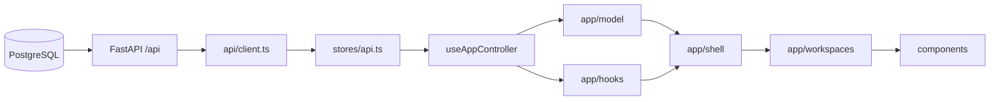

# Web Application Architecture

Mandarin companion: [WEB_APPLICATION_ARCHITECTURE-CN.md](WEB_APPLICATION_ARCHITECTURE-CN.md)

## Purpose

This document is the implementation authority for the React application
structure under `clients/web/src`. It defines where application behavior belongs
and prevents the composition root, UI components, or browser bundle from
becoming an alternative backend or runtime data store.

## Runtime boundary



The browser never reads PostgreSQL, local runtime files, `.env`, provider APIs,
or provider credentials. Simulated and preview records follow the same
PostgreSQL-to-API path as licensed records.

## Directory ownership

| Path | Owner responsibility |
| --- | --- |
| `App.tsx` | Composition root only: create the controller and render the shell. |
| `app/hooks/` | Stateful interaction and lifecycle orchestration, grouped by workflow. |
| `app/model/` | Derived application models that combine API state into view-ready decision context. No fetching or rendered markup. |
| `app/shell/` | Persistent application chrome and map cockpit composition. |
| `app/workspaces/` | Workspace selection and page-level component wiring. |
| `app/*.ts` | Pure builders, normalization, metadata, and derived-data helpers. |
| `components/` | Domain-focused rendering and local presentation interaction. |
| `api/client.ts` | HTTP DTOs, response parsing, and configured `/api` transport. |
| `stores/api.ts` | Backend request actions and normalized API state. |
| `stores/theme.ts` | Theme preference only. |
| `i18n/` | English and Mandarin display strings. |
| `styles/` | Shared visual tokens and ordered legacy/application styles. |

## Active application modules

- `useWorkspaceNavigation`: URL parsing, history updates, and popstate handling.
- `useWorkspaceRuntime`: initial backend hydration and market-page refresh lifecycle.
- `useCockpitControls`: map layers, search, gas day, and product controls.
- `useContractEditor`: EFET-style resource-term draft and import interaction.
- `useSourceCenterController`: source selection, categories, credential submission, and diagnostics formatting.
- `useGlossaryExplorer`: term filtering, duration context, and context requests.
- `useReviewAnalysis`: report question and backend LLM invocation request state.
- `usePortfolioDecisionModel`: PostgreSQL/API-backed portfolio resources, sale options, optimization requests, route-map paths, evidence, and decision metrics.
- `AppShell`: top bar and Network cockpit.
- `WorkspaceRenderer`: the single mapping from workspace id to page component.

## Dependency direction

Allowed:

```text
App -> controller -> hooks/models -> pure app helpers
App -> shell -> workspace renderer -> components
hooks/models -> API DTO types and API store contract
components -> API DTO types and pure formatting helpers
```

Forbidden:

- components importing PostgreSQL, backend domain, connector, ingestion, or runtime-store modules;
- pure builders calling React hooks, Zustand actions, `fetch`, or Tauri APIs;
- page components creating authoritative market, capacity, tariff, topology, contract, or PnL rows;
- adding a second workspace-id list outside `workspaceNavigation.ts`;
- putting workspace conditionals, polling, or business derivation back in `App.tsx`.

## Size and extraction rules

- `App.tsx` must remain at or below 20 lines and is enforced by contract tests.
- Hooks should own one workflow. Split a hook when it mixes unrelated lifecycle or form responsibilities.
- Derived models may coordinate a complex decision view but should stay below roughly 350 lines; move deterministic calculations to pure builders first.
- Workspace renderers should stay below roughly 300 lines. Extract a page component rather than embedding page markup.
- A component above roughly 450 lines is a refactoring signal, not an accepted template for new work.
- File length alone does not justify abstraction. Extraction must create a stable ownership boundary.

## Adding a capability

1. Add or update backend/API/SDK contracts first when new runtime data is required.
2. Add DTOs and API-store state/actions without embedding fallback business data.
3. Put deterministic conversion in `app/*.ts` or a domain subdirectory.
4. Put workflow state in one focused hook.
5. Add the page component under `components/` and wire it once in `WorkspaceRenderer`.
6. Add English and Mandarin strings together.
7. Update owner-based contract tests and run the Web production build.

## Known structural debt

`styles/app.css` is an ordered compatibility cascade accumulated through the
preview redesigns. It remains intentionally unchanged in R30A to avoid visual
regression. A later style-only ExecPlan should introduce tokens/base/layout and
workspace style modules while preserving cascade order and screenshot-tested
light/dark behavior.
