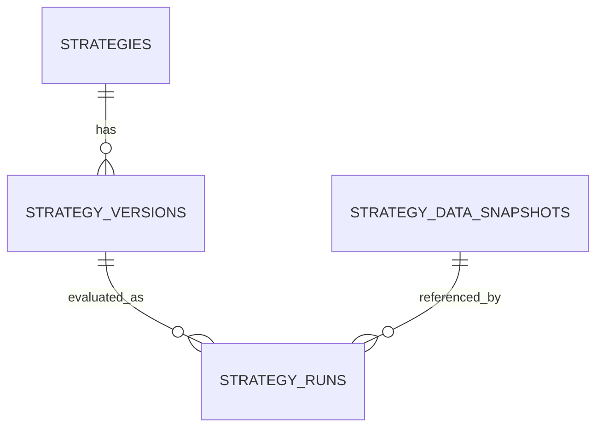

# Strategy Domain Model — CR-03

Status: accepted CR-03 architecture. This document owns strategy identity,
versioning, run provenance, and temporal-integrity semantics.

## 1. Problem statement

Today strategy definitions live only in the legacy `strategy_definitions` table
(unused by APIs), the current evaluation payload is client-supplied ad hoc JSON,
and persisted `strategy_runs` store input/result snapshots without an exact
version reference, dataset evidence, data cutoff, or engine/application
version. Editing a screen later can therefore change how an old run is
understood.

## 2. Terminology

- **Strategy** — long-lived research identity.
- **StrategyVersion** — one immutable semantic definition of that strategy.
- **StrategyRun** — one immutable evaluation of one exact version against one
  evidence context.
- **RunManifest** — serialized effective-input evidence for a run.
- **DataSnapshot** — referenced evidence bundle, not duplicated market data.

## 3. Research principles used

Public research patterns reviewed: MLflow tracking run lineage, Valohai
reproducibility-by-default, GitLab experiment tracking, and QuantConnect
algorithm/dataset versioning. Extracted principles:

- separate identity, immutable definition, and run;
- freeze effective inputs before execution;
- record code/data versions;
- reference datasets rather than copying them;
- never let later edits reinterpret historical runs.

No ML-specific architecture is imported; European gas context adds gas-day,
hub basis, capacity, tariff, FX, storage, balancing, and licensed-source
provenance requirements.

## 4. Strategy aggregate



Fields:

- `strategy_id` — stable machine identity (PK).
- `name`, `description`, `tags` — human context only, never identity.
- `lifecycle_status` — `RESEARCH` or `RETIRED`.
- `current_version_id` — pointer to latest frozen version when present.
- `created_by`, `created_at_utc`, `updated_at_utc`, `retired_at_utc`.

## 5. StrategyVersion

- `strategy_version_id` — stable machine identity (PK).
- `strategy_id` — FK to strategy.
- `version_number` — monotonic integer, unique per strategy.
- `schema_version` — `strategy-definition/v1`.
- `status` — `DRAFT`, `FROZEN`, or `RETIRED`.
- `parent_version_id` — optional source version for forks.
- `hypothesis`, `definition_json`, `content_hash`.
- `created_by`, `created_at_utc`, `frozen_at_utc`.

`definition_json` contains typed structured fragments, not an arbitrary blob:
components, parameter definitions, parameter values, risk controls, economic
assumptions, data requirements, and evaluation windows.

## 6. Strategy lifecycle

Only truthful states are implemented:

```text
RESEARCH -> RETIRED
```

Shadow activation is deferred until the future scheduler exists. The backend
enum reserves `SHADOW`/`PAUSED` but no write endpoint transitions into those
states in CR-03.

## 7. Version lifecycle

```text
DRAFT -> FROZEN -> RETIRED
```

- DRAFT may be edited.
- FROZEN is immutable.
- Editing FROZEN means "create a new DRAFT version from this version"; the new
  version increments `version_number` and records `parent_version_id`.
- Version lifecycle is distinct from strategy lifecycle.

## 8. Component model

Typed component contract:

- `component_id`;
- `component_type` — currently executable vocabulary:
  `OCM_VS_DAY_AHEAD`, `MEAN_REVERSION`, `BEST_BUCKETS`, `SCORING`,
  `WEIGHTED_COMBINATION`. Future component families (`HUB_SPREAD`,
  `TIME_SPREAD`, `OUTRIGHT`, `PHYSICAL_RESOURCE`, `ROUTE_CAPACITY`,
  `STORAGE`, `FX`, `BENCHMARK_INDEX`) are reserved as extension vocabulary;
- `role` — signal, hedge, constraint, benchmark;
- `hubs[]`, `tenors[]`;
- `price_basis`;
- optional `resource_id`;
- `parameter_refs[]`;
- `required_evidence[]`;
- `extension_json` for future semantics.

The current NBP SAP/ICIS vs ICE OCM window maps to one
`OCM_VS_DAY_AHEAD` component.

## 9. Parameters

`ParameterDefinition` separates definition from value:

- `parameter_id`, `name`;
- `type` — `INTEGER`, `DECIMAL`, `BOOLEAN`, `ENUM`, `DURATION`,
  `PERCENTAGE`;
- `unit` (explicit, not implied);
- `min`, `max`, `allowed_values`;
- `optimization_allowed`, `sensitivity_allowed`.

Values live in `parameter_values` keyed by `parameter_id`. Strings are not the
default representation for numeric parameters.

## 10. Risk controls

`RiskControlSpec` normalizes current fields:

- `max_ocm_allocation_pct` (percentage);
- `min_day_ahead_allocation_pct` (percentage);
- `max_single_market_volume_mwh_per_day` (MWh/day or null);
- `min_expected_margin_gbp_mwh` (GBP/MWh or null);
- `stop_shadow_run_loss_gbp` (GBP or null);
- `require_tso_access` (boolean).

Semantics are hard-blocks, not warnings, where the current evaluator already
blocks or partially blocks.

## 11. Economic assumptions

Explicit defaults; omitted values never silently mean zero friction:

- `transaction_cost_policy` — `EXPLICIT_ZERO_UNMODELED`;
- `bid_ask_policy` — `MID` unless quotes are supplied;
- `slippage_policy` — `UNMODELED`;
- `transport_cost_policy` — `ROUTE_COST_REQUIRED`;
- `balancing_allowance_policy` — `RESOURCE_DEFINED`;
- `fx_policy` — `AS_OF_OR_LATEST_WITH_WARNING`;
- `tariff_source` — `PUBLISHED_OR_OPERATOR`;
- `missing_data_policy` — `BLOCK_OR_PARTIAL`;
- `capacity_policy` — `UNKNOWN_BLOCKS`.

## 12. Data requirements

Requirements are a specification, not run evidence:

- hubs; delivery products; price bases; source classes;
- `max_source_age_seconds`; currencies; FX requirement; resource/capacity/
  tariff context requirement.

## 13. StrategyRun

Professional run contract:

Identity: `run_id`, `run_type`, `strategy_id`, `strategy_version_id`.
Status: `QUEUED`, `RUNNING`, `COMPLETED`, `FAILED`, `CANCELLED`.
Time: requested/started/completed, evaluation start/end, `data_cutoff_utc`.
Reproducibility: engine version, application version, `git_commit_sha`,
strategy schema version, run schema version, deterministic seed.
Evidence: `dataset_snapshot_id`, source refs, FX refs, resource snapshot refs,
row counts, freshness/quality state.
Output: result snapshot and warning/blocker counts in the run record.
Audit: `requested_by`, trigger type, correlation/request id.

## 14. RunManifest

Immutable serialized effective inputs, stored in `manifest_json` and hashed as
`manifest_hash`. The manifest includes exact version id, parameter values,
assumptions, trader context, evaluation window, data cutoff, snapshot refs,
source refs, and engine/app versions.

## 15. DataSnapshot / evidence design

`strategy_data_snapshots` stores references and quality/counts, not copied raw
market data:

- `snapshot_id`, `data_cutoff_utc`;
- observation ids, FX observation ids, resource snapshot ids;
- source systems, row counts, quality state;
- `content_hash`.

Tradeoff: normalized runtime rows remain authoritative; the snapshot table
keeps run reproducibility explicit. CR-03 builds a lightweight evidence bundle
(cutoff, referenced observation/resource ids, source systems, row counts,
quality state) for every professional run. Reconstructing the bundle from
runtime rows as of the cutoff is the CR-04 dataset-snapshot milestone.

## 16. Temporal integrity

Distinct concepts:

- `observed_at_utc` — source observation effective time;
- `available_at_utc` — when the platform could reasonably know it;
- `period_start/end` — delivery period;
- `ingested_at_utc` — platform receipt time;
- `data_cutoff_utc` — max information time allowed for a simulated decision.

Current schema has `observed_at_utc` on observations and `received_at_utc` on
market quotes, but no universal `available_at_utc`/`ingested_at_utc`.
Therefore CR-03 stores `data_cutoff_utc` and records observation/resource
references in the run manifest, but it does not fabricate
`available_at_utc`/`ingested_at_utc`. A future availability-proof milestone
must either prove those timestamps or fail closed before claiming look-ahead
safety.

## 17. Content hashing

- Canonical JSON: keys sorted, separators compact, non-semantic metadata
  excluded.
- `strategy_version.content_hash` covers the complete stored
  `definition_json` (typed semantic fragments plus legacy execution inputs
  needed by the current evaluator); excludes hypothesis, timestamps, ids,
  status, and version number.
- `run_manifest.manifest_hash` covers effective run inputs: exact version id
  and content hash, full definition, parameters, assumptions, evidence
  snapshot, data cutoff, source/resource refs, engine/app/git/seed, and
  research guardrails. It excludes run id and wall-clock evaluation
  start/end timestamps so otherwise-identical reruns of the same effective
  inputs share a hash.
- `strategy_data_snapshot.content_hash` covers referenced ids/counts/cutoff.
- Hashes are audit/reproducibility identifiers, not security signatures.

## 18. API model

New research API:

- `GET /api/strategies`
- `POST /api/strategies`
- `GET /api/strategies/{strategy_id}`
- `GET /api/strategies/{strategy_id}/versions`
- `POST /api/strategies/{strategy_id}/versions`
- `GET /api/strategy-versions/{strategy_version_id}`
- `POST /api/strategy-versions/{strategy_version_id}/freeze`
- `POST /api/strategy-versions/{strategy_version_id}/fork`
- `POST /api/strategy-runs`
- `GET /api/strategy-runs`
- `GET /api/strategy-runs/{run_id}`

Only `run_type=EVALUATION` is executable in CR-03. Other run types fail with
`run_type_not_supported`. The old `/api/strategy-lab/*` remains the legacy
compatibility path.

## 19. DB model

Tables:

- `strategies`
- `strategy_versions`
- `strategy_data_snapshots`
- extended legacy `strategy_runs`

Alembic migration `0025_strategy_registry_v1` chains from
`0024_cost_observations`. Legacy `strategy_definitions`, `strategy_runs`, and
`strategy_allocation_targets` remain readable; no legacy rows are dropped.

## 20. Compatibility

- Existing `/api/strategy-lab/evaluate`, runs, and summary endpoints remain.
- Existing `strategy_runs` serializer now exposes new provenance fields with
  `null` for legacy rows.
- Existing Web Strategy terminal remains functional and gains a small run
  provenance panel (version id, run type, manifest hash, data cutoff,
  engine/application/git, snapshot id) for versioned runs.
- Existing `strategy_definitions` table is frozen legacy and is not extended.

## 21. Future Backtest milestone

CR-04 will add dataset snapshot construction, as-of joins, look-ahead-safe
observation selection, walk-forward/experiment design, and professional
backtest metrics. CR-03 supplies the exact version/manifest foundation.

## 22. Future Shadow milestone

CR-05+ will add scheduler state, restartable shadow jobs, pause/resume/retire,
source-freshness blocking, and drift indicators. CR-03 supplies the immutable
version contract used by shadow evaluations.
